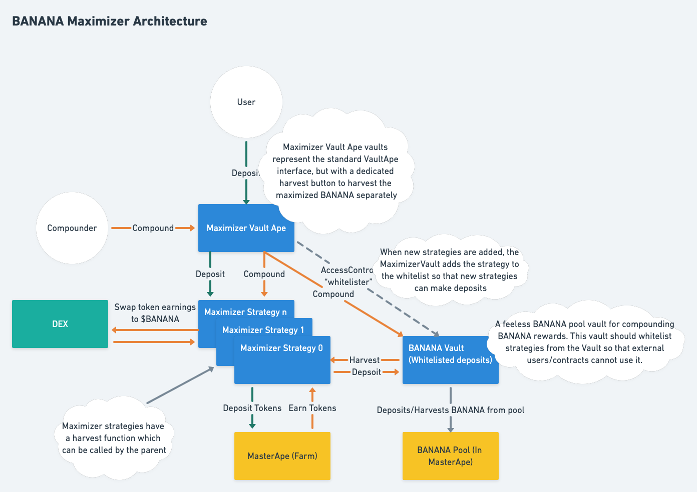

# ApeSwap Vaults

  
Automated fund management contracts which work on top of the ApeSwap farm.

## Setup
Create a `.env` file based off of `.env.example` to deploy contracts to bsc mainnet/testnet and to verify deployed contracts.  

 

## Development
Start a local development blockchain by running the following command:  
`yarn ganache`  
  
Deploy contracts to the development blockchain:  
`yarn migrate:development` 

## Compile
`yarn compile`

 

## Deploy 

### Mainnet
`yarn migrate:bsc [--reset]` // Use `--reset` to redeploy already deployed contracts   
`yarn verify:bsc`  

### Testnet
`yarn migrate:testnet [--reset]`  
`yarn verify:testnet`  
  
_* new contracts that are created must be added to the verification script in package.json by adding `&&` to the end with the new contract verification._

## Lint
Lint with `solhint`  
`yarn lint` / `yarn lint:fix`    

 

## Test
Tests are architected with `@openzeppelin` test environment. This allows tests to be run independently of an external development blockchain.   

Test the project with `yarn test`   

Tests are using  
`@openzeppelin/test-helpers`  
`@openzeppelin/test-environment` 

 

### Solidity Coverage
[solidity-coverage](https://www.npmjs.com/package/solidity-coverage) is used in this repo to provide an output of the test coverage after running tests.

### Automated Tests
The OpenZeppelin test environment coupled with Github actions facilitates automated contract tests on pushes to GitHub! 

 

## Generate Types from Contracts
Use `typechain` to generate contract interfaces for UI integration.  
`yarn gen:types`  

## Contract Size 
Use the `truffle-contract-size` module to find the size of each contract in the `contracts/` directory with:  
`yarn size`  

## Deployed Contracts:

VaultApe:                   https://bscscan.com/address/0xa4c084d141A4E54F3C79707d58229e9e64bdF0aC#writeContract
StrategyMasterChefSingle:   https://bscscan.com/address/0x27619a7919bf31c15fca24dd10ccdb3f290b3581#code
StrategyMasterApeSingle:    https://bscscan.com/address/0x51b13b0068d27fd49284b3ceac7c55d372602ad9#readContract
StrategyMasterChef:         https://bscscan.com/address/0x5199e3ac3a64e8413f1fa3485b58a4741f23eb99#code

# Maximizer Vaults
The [Maximizer contracts](./contracts/maximizer/) are vaults which earns reward tokens from ApeSwap or external farms. The reward tokens are then swapped into BANANA (if needed), added to the ApeSwap BANANA pool where the BANANA earnings are continuously compounded. These vaults were built to help alleviate the continuous sell pressure that normal vaults typically put on BANANA.

## Operation

### Chainlink Keepers
The [KeeperMaximizerVaultApe.sol](./contracts/maximizer/KeeperMaximizerVaultApe.sol) contract is an extension of the `MaximizerVaultApe` contract to allow the vaults to be registered on the **Chainlink Keeper Network**.

#### Setup
1. Deploy `KeeperMaximizerVaultApe.sol`.
2. Register the address of `KeeperMaximizerVaultApe` [here](https://keepers.chain.link/new). 
   1. Choose the proper network by changing the network of your wallet
   2. You will need to have some [LINK](https://coinmarketcap.com/currencies/chainlink/) in your wallet to fund the initial registration
3. Once the upkeep address is registered you can add LINK funds and monitor the history through Chainlink's UI (ex: [testnet-keeper](https://keepers.chain.link/chapel/246))

#### Resources
- Register Keeper [docs](https://docs.chain.link/docs/chainlink-keepers/register-upkeep/).
- Check the keeper [network overview](https://docs.chain.link/docs/chainlink-keepers/overview/#configuration) for the Keeper Registry contract and individual network configuration settings.  
- Get testnet LINK [here](https://faucets.chain.link/chapel).  
### Architecture
